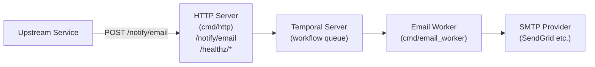

# Beacon

Beacon is an async notification service built in Go. It currently supports email delivery via SMTP, with Temporal handling workflow orchestration, retries, and fault tolerance.

---

## Architecture



1. The **HTTP server** receives an email request and starts a Temporal workflow.
2. The **Temporal server** queues and durably tracks the workflow.
3. The **email worker** picks up the workflow, executes the activity, and sends the email via SMTP.
4. Failed activities are retried automatically with exponential backoff (3 attempts, 2× coefficient, up to 2 minutes between retries).

---

## Components

| Component | Path | Description |
|---|---|---|
| HTTP Server | `cmd/http/` | REST API for submitting notifications and health checks |
| Email Worker | `cmd/email_worker/` | Temporal worker that executes email send workflows |
| Config Service | `internal/config/` | Loads and validates SMTP configs from Infisical (or dev env vars) |
| Email Notifier | `internal/notifier/` | SMTP email delivery using `gopkg.in/mail.v2` |
| Temporal Layer | `internal/temporal/` | Workflow and activity definitions |
| API Handlers | `internal/api/` | HTTP request/response handling |

---

## Prerequisites

- Go 1.24+
- A running [Temporal server](https://learn.temporal.io/getting_started/go/dev_environment/) (`localhost:7233` by default)
- An SMTP provider (SendGrid, Gmail SMTP, etc.) — or dev mode for local testing

---

## Configuration

Beacon is configured via environment variables. Copy `.env.example` to `.env` and fill in the values.

### Core

| Variable | Default | Description |
|---|---|---|
| `SERVER_PORT` | `6969` | HTTP server port |
| `EMAIL_NOTIFIER_TASK_QUEUE` | `email-task-queue` | Temporal task queue name (must match between server and worker) |

### Temporal

| Variable | Default | Description |
|---|---|---|
| `TEMPORAL_ADDRESS` | `localhost:7233` | Temporal server address |
| `TEMPORAL_NAMESPACE` | `default` | Temporal namespace |

### SMTP Config (via Infisical — production)

Beacon loads SMTP provider configuration from [Infisical](https://infisical.com/) at path `/beacon/smtp`. See `infisical-example.json` for the expected JSON shape.

| Variable | Description |
|---|---|
| `INFISICAL_ADDR` | Infisical instance URL |
| `INFISICAL_PROJECT_ID` | Project ID |
| `INFISICAL_ENVIRONMENT` | Environment (e.g. `dev`, `prod`) |
| `INFISICAL_CLIENT_ID` | Machine identity client ID |
| `INFISICAL_CLIENT_SECRET` | Machine identity client secret |

### SMTP Config (dev mode — local testing)

Set `DEV_MODE=true` to skip Infisical and load SMTP config directly from env vars.

| Variable | Description |
|---|---|
| `DEV_MODE` | Set to `true` to enable dev mode |
| `DEV_SMTP_HOST` | SMTP host (e.g. `smtp.sendgrid.net`) |
| `DEV_SMTP_PORT` | SMTP port (e.g. `587`) |
| `DEV_SMTP_USERNAME` | SMTP username |
| `DEV_SMTP_PASSWORD` | SMTP password |
| `DEV_SMTP_AUTH_TYPE` | Auth type: `PLAIN`, `LOGIN`, or `OAUTH2` |

---

## Building and Running

```bash
# Build both binaries into bin/
make build

# Build individually
make build-http
make build-email-worker

# Run
make run-http          # starts HTTP server
make run-email-worker  # starts Temporal worker

# Clean
make clean
```

Both the HTTP server and the email worker must be running for email delivery to work.

---

## API

### Send an Email

```
POST /notify/email
Content-Type: application/json
```

**Request body:**

```json
{
  "to": "recipient@example.com",
  "subject": "Hello from Beacon",
  "body": "This is the email body."
}
```

| Field | Required | Description |
|---|---|---|
| `to` | Yes | Recipient email address |
| `subject` | Yes | Email subject |
| `body` | No | Email body (plain text) |

**Response — 202 Accepted:**

```json
{
  "workflow_id": "email-workflow-recipient@example.com-1714567890123456789",
  "workflow_run_id": "abc123-..."
}
```

Beacon returns immediately after the workflow is started. Delivery happens asynchronously.

**Error responses:**

| Status | Reason |
|---|---|
| `400 Bad Request` | Missing or invalid request body, missing `to` or `subject` |
| `405 Method Not Allowed` | Non-POST request |
| `503 Service Unavailable` | Temporal server is unreachable |
| `500 Internal Server Error` | Workflow failed to start |

---

### Health Checks

```
GET /healthz/live   → 200 OK  (liveness — process is alive)
GET /healthz/ready  → 200 OK  (readiness — server is ready to serve traffic)
```

---

## Consuming Beacon from an Upstream Service

Any service that can make HTTP requests can send emails through Beacon.

**Example — cURL:**

```bash
curl -X POST http://beacon-host:6969/notify/email \
  -H "Content-Type: application/json" \
  -d '{
    "to": "user@example.com",
    "subject": "Your order has shipped",
    "body": "Track your order at https://example.com/orders/123"
  }'
```

**Example — Go:**

```go
payload := map[string]string{
    "to":      "user@example.com",
    "subject": "Your order has shipped",
    "body":    "Track your order at https://example.com/orders/123",
}
body, _ := json.Marshal(payload)

resp, err := http.Post("http://beacon-host:6969/notify/email", "application/json", bytes.NewReader(body))
if err != nil {
    // handle connection error
}
defer resp.Body.Close()

if resp.StatusCode == http.StatusAccepted {
    // email workflow started — delivery is async
}
```

**Example — Python:**

```python
import requests

response = requests.post(
    "http://beacon-host:6969/notify/email",
    json={
        "to": "user@example.com",
        "subject": "Your order has shipped",
        "body": "Track your order at https://example.com/orders/123",
    }
)

if response.status_code == 202:
    data = response.json()
    print("workflow started:", data["workflow_id"])
```

The `202 Accepted` response means the workflow was enqueued. Email delivery is asynchronous — the upstream service does not need to wait or poll.

---

## Local Development Setup

1. Start Temporal (using the Temporal CLI):
   ```bash
   temporal server start-dev
   ```

2. Create a `.env` file:
   ```bash
   cp .env.example .env
   # Set DEV_MODE=true and fill in DEV_SMTP_* vars
   ```

3. Build and run:
   ```bash
   make run-http &
   make run-email-worker
   ```

4. Send a test email:
   ```bash
   curl -X POST http://localhost:6969/notify/email \
     -H "Content-Type: application/json" \
     -d '{"to":"you@example.com","subject":"Test","body":"Hello!"}'
   ```
