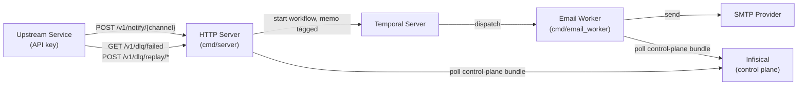

# Beacon — Architecture

## Overview

Beacon is an async notification service. Upstream services authenticate with a per-service API
key and submit notification requests over HTTP; Beacon enforces per-service policy (channel
binding, provider allowlist, rate limits) and hands delivery off to Temporal workflows, decoupling
the caller from the underlying provider.

## Components



### HTTP Server (`cmd/server`)

Entry point for all notification requests. Every `/v1/*` route runs behind `auth.Middleware`,
which resolves the caller's API key to an `Identity` (service, tenant, enabled flag, per-channel
policy) or an unscoped admin identity when the presented token matches `ADMIN_TOKEN`.

Middleware chain for `POST /v1/notify/{channel}` (each step can short-circuit; see
`docs/API.md` for the full ordered error table):

```
auth.Middleware (401/403 disabled)
  -> reject admin-token callers (403)
  -> resolve {channel} from channel.Registry (404)
  -> enforce ident.Channels[channel] policy exists (403)
  -> 256 KB body cap (413) / decode + validate channel payload (400)
  -> policy.ResolveProvider: allowlist + default binding (403) / notifier.ProviderRegistry existence check (503)
  -> validate Idempotency-Key (400)
  -> policy.RateLimiter.Allow: rpm + daily quota (429)
  -> ExecuteWorkflow (500, or 202 with duplicate detection)
```

`GET /v1/dlq/failed` and `POST /v1/dlq/replay/{workflowID}` run behind the same `auth.Middleware`;
non-admin callers are hard-scoped to their own tenant, admins are unscoped by default. The server
also exposes `/healthz/live` and `/healthz/ready`, and `POST /admin/config/refresh` (its own
`ADMIN_TOKEN` check, independent of `/v1` auth).

The server wiring lives in `internal/app` (`BuildServerMux`), which is extracted from `main()` to
allow unit testing.

### Channel Seam (`internal/channel`)

New notification channels plug in through the `Channel` interface (`Name`, `DecodeRequest`,
`TaskQueue`, `WorkflowName`). `DecodeRequest` turns a raw request body into a channel-neutral
`Request` wrapping a `models.Notification` — auth, policy, rate limiting, idempotency, and the DLQ
all operate on that envelope and never inspect channel-specific payload fields. Only the `email`
channel is implemented; adding a second channel means implementing this interface and registering
it in `channel.NewRegistry`, with no changes to the shared request-handling chain.

### Email Worker (`cmd/email_worker`)

A Temporal worker that listens on a `(channel, provider)`-specific task queue
(`{channel}-{provider}-queue`, e.g. `email-sendgrid-queue`). Which pair it serves is set via
`WORKER_SPEC=<channel>-<provider>` (or `CHANNEL` + `PROVIDER_NAME` separately) — see
`docs/CONFIGURATION.md`. It executes `SendEmailWorkflow`, which calls `SendEmailActivity` to
deliver the email via `notifier.EmailSender`.

Failed activities are retried with exponential backoff before the workflow faults. The worker
exposes **no** HTTP endpoints — no health checks, no admin API. Only the HTTP server does.

### Auth (`internal/auth`)

`auth.Registry` indexes active API-key SHA-256 hashes to `Identity` values, rebuilt wholesale on
every config reload (`Reload`). `auth.Middleware` extracts the presented key from
`Authorization: Bearer` (checked first) or `X-API-Key`, matches it against `ADMIN_TOKEN` via
constant-time comparison for the admin path, otherwise looks it up in the registry. Plaintext keys
are never stored or logged — only their hash is compared.

### Policy (`internal/policy`)

Two independent concerns, both driven by a service's `ChannelPolicy` (from the control-plane
bundle):

- `provider.go` — `ResolveProvider` implements provider binding: an empty request provider
  resolves to the service's `default_provider`; an explicit one must be in the service's
  `providers` allowlist or the request is rejected.
- `ratelimit.go` — `MemoryLimiter` is an in-memory token bucket (RPM) plus a UTC-day counter
  (daily quota), keyed by `service|channel`. Counters live in process memory only and reset on
  restart — there is no persistent/shared limiter store.

Sender-identity injection (the policy-locked `From` address/name) happens directly in
`NotifyHandler`, using `ChannelPolicy.From` — the request body can never set it.

### Config Service and ConfigWatcher (`internal/config`)

Loads and validates the control-plane bundle (SMTP providers, tenants, services) at startup. In
production this is fetched from Infisical (`/beacon/providers/email`, `/beacon/tenants`,
`/beacon/services`); in development it falls back to environment variables (`DEV_MODE=true`,
synthesizing a single `dev` tenant/service).

The `ConfigWatcher` polls on a configurable interval (`CONFIG_POLL_INTERVAL`, default 300 s) and
hot-reloads the server's `notifier.ProviderRegistry` and `auth.Registry`, or the worker's
`notifier.EmailSender` (swapped via an atomic pointer). A failed fetch or validation reverts to
the previously loaded bundle (fail-closed) rather than running with a partial config.

`config.HealthChecker` backs `/healthz/ready`: it evaluates named checks (config loaded, Temporal
`CheckHealth`) with a 5 s result cache and a 2 s per-evaluation timeout that is independent of any
single caller's request context, so one short-timeout prober can't poison the shared cache with
its own cancellation.

### Notifier (`internal/notifier`)

- `ProviderRegistry` — tracks which provider names exist per channel (server-side existence
  checks and routing only; it does not hold credentials).
- `EmailSender` — delivers via `gopkg.in/mail.v2`, honoring the provider's TLS mode (implicit TLS
  on port 465, mandatory STARTTLS otherwise when `tls.enabled`), timeout, and from-address
  semantics (payload `From*`, when set by policy, takes priority over the provider's configured
  default). The SMTP connection is kept open across sends and re-dialed once, only on
  transport-level failures (timeout, EOF, ECONNRESET/EPIPE) — protocol-level SMTP rejections are
  not retried, to avoid double-delivering a message whose `DATA` was already accepted.

### DLQ Service (`internal/dlq`)

Queries Temporal's `ListClosedWorkflowExecutions` for terminal failures and dispatches replay
workflows from the original input recovered from workflow history. Tenant/service/provider scoping
is powered by **workflow memos** (`service`, `tenant`, `channel`, `provider`), stamped at dispatch
time by `NotifyHandler` and carried forward into a replay's memo — not decoded from the payload,
so scoping survives even when history decoding of the input fails. Exposed via
`GET /v1/dlq/failed` and `POST /v1/dlq/replay/{workflowID}`.

### Admin Handler (`internal/api`)

`POST /admin/config/refresh` forces an immediate config re-fetch and registry reload, returning
the new revision, loaded provider names, and service count. The endpoint is disabled (`403`) when
`ADMIN_TOKEN` is not set, and returns `503` in `DEV_MODE` (no control plane to refresh against).

## Component Inventory

| Component | Path | Description |
|---|---|---|
| HTTP Server | `cmd/server/` | REST API for submitting notifications, health, admin, and DLQ endpoints |
| Email Worker | `cmd/email_worker/` | Temporal worker that executes email send workflows for one `(channel, provider)` |
| Server/Worker Wiring | `internal/app/` | `BuildServerMux`, `ResolveWorkerProvider`, `ParseWorkerSpec` — extracted for testability |
| Auth | `internal/auth/` | API-key hashing, `Registry` lookup, `Middleware` — resolves requests to a service `Identity` |
| Policy | `internal/policy/` | Provider binding (`ResolveProvider`) and per-service rate limiting (`MemoryLimiter`) |
| Channel Seam | `internal/channel/` | `Channel` interface + `email` implementation — request decoding/validation |
| Config Service | `internal/config/` | Loads/validates the control-plane bundle from Infisical (or dev env vars); `ConfigWatcher` for hot-reload; `HealthChecker` for readiness |
| Notifier | `internal/notifier/` | `ProviderRegistry` (existence checks) and `EmailSender` (SMTP delivery, connection reuse) |
| DLQ Service | `internal/dlq/` | Queries Temporal for failed workflows (memo-scoped); dispatches replay executions |
| Temporal Layer | `internal/temporal/` | `SendEmailWorkflow` and `SendEmailActivity` definitions |
| API Handlers | `internal/api/` | HTTP request/response handling for notify, admin, and DLQ endpoints |
| Models | `internal/models/` | `Notification` — the channel-neutral envelope persisted as workflow input; `EmailPayload` |

## Request Lifecycle

1. Upstream POSTs a channel payload (e.g. `{ to, subject, body, cc?, bcc?, html?, provider? }`) to
   `POST /v1/notify/{channel}` with an API key and optional `Idempotency-Key` header.
2. `auth.Middleware` resolves the key to a service `Identity`; `NotifyHandler` resolves the
   channel, enforces the service's channel policy, decodes/validates the payload, resolves the
   provider (allowlist + default binding), and checks the rate limiter.
3. On success, the handler stamps the channel-neutral `Notification` envelope with
   service/tenant/provider/timestamp and the policy-locked sender identity, starts a Temporal
   workflow on `{channel}-{provider}-queue` (memo-tagged with service/tenant/channel/provider), and
   returns `202` with the workflow ID, run ID, provider, and a `duplicate` flag.
4. Temporal durably queues the workflow.
5. The channel-specific worker (e.g. the email worker) picks up the task and calls the provider
   via its activity (e.g. `SendEmailActivity`).
6. On transient failure, Temporal retries automatically (3 attempts, exponential backoff); on
   exhaustion the workflow closes as Failed and appears in `GET /v1/dlq/failed`, scoped to the
   memo's tenant for non-admin callers.
7. A failed workflow can be replayed via `POST /v1/dlq/replay/{workflowID}` (subject to the same
   tenant scoping), which re-dispatches a new execution using the original input, preserving the
   memo.

## Tech Stack

| Concern | Technology |
|---|---|
| Language | Go 1.24 |
| Workflow orchestration | [Temporal](https://temporal.io) |
| Email delivery | SMTP via `gopkg.in/mail.v2` |
| Secret management | [Infisical](https://infisical.com) |
| Config | Environment variables + `.env` |
