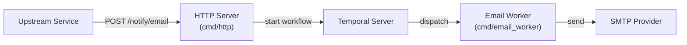

# Beacon — Architecture

## Overview

Beacon is an async notification service. Upstream services submit notification requests over HTTP; Beacon handles delivery asynchronously via Temporal workflows, decoupling the caller from the underlying provider.

## Components

### HTTP Server (`cmd/http`)

Entry point for all notification requests. It validates the request, starts a Temporal workflow, and returns `202 Accepted` immediately — the caller does not wait for delivery.

Also exposes `/healthz/live` and `/healthz/ready` for health checks.

### Email Worker (`cmd/email_worker`)

A Temporal worker that listens on the email task queue. It executes the `SendEmailWorkflow`, which calls the `SendEmailActivity` to deliver the email via SMTP.

Failed activities are retried with exponential backoff before the workflow faults.

### Config Service (`internal/config`)

Loads and validates SMTP provider configuration at startup. In production this is fetched from Infisical; in development it falls back to environment variables (`DEV_MODE=true`).

## Request Lifecycle

1. Upstream POSTs `{ to, subject, body }` to `/notify/email`
2. HTTP server starts a Temporal workflow and returns `202` with the workflow ID
3. Temporal durably queues the workflow on the email task queue
4. Email worker picks up the task and calls the SMTP provider
5. On transient failure, Temporal retries automatically (3 attempts, exponential backoff)

## Tech Stack

| Concern | Technology |
|---|---|
| Language | Go 1.24 |
| Workflow orchestration | [Temporal](https://temporal.io) |
| Email delivery | SMTP via `gopkg.in/mail.v2` |
| Secret management | [Infisical](https://infisical.com) |
| Config | Environment variables + `.env` |
