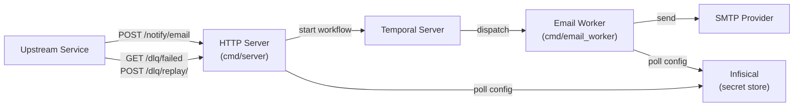

# Beacon — Architecture

## Overview

Beacon is an async notification service. Upstream services submit notification requests over HTTP; Beacon handles delivery asynchronously via Temporal workflows, decoupling the caller from the underlying provider.

## Components

### HTTP Server (`cmd/server`)

Entry point for all notification requests. It validates the request, starts a Temporal workflow, and returns `202 Accepted` immediately — the caller does not wait for delivery.

Also exposes `/healthz/live` and `/healthz/ready` for health checks, `POST /admin/config/refresh` (protected by `ADMIN_TOKEN`), and the DLQ endpoints (`GET /dlq/failed`, `POST /dlq/replay/{workflowID}`).

The server wiring lives in `internal/app` (`BuildServerMux`), which is extracted from `main()` to allow unit testing.

### Email Worker (`cmd/email_worker`)

A Temporal worker that listens on a provider-specific task queue (`email-<provider>-queue`). It executes the `SendEmailWorkflow`, which calls the `SendEmailActivity` to deliver the email via SMTP.

Failed activities are retried with exponential backoff before the workflow faults.

### Config Service and ConfigWatcher (`internal/config`)

Loads and validates SMTP provider configuration at startup. In production this is fetched from Infisical; in development it falls back to environment variables (`DEV_MODE=true`).

The `ConfigWatcher` polls Infisical on a configurable interval (`CONFIG_POLL_INTERVAL`, default 300 s) and hot-reloads the `EmailClientRegistry` (server) or `EmailService` (worker) without restarting.

### DLQ Service (`internal/dlq`)

Queries Temporal's workflow history for closed executions in terminal failure states and dispatches replay workflows from the original input. Exposed via `GET /dlq/failed` and `POST /dlq/replay/{workflowID}`.

### Admin Handler (`internal/api`)

`POST /admin/config/refresh` forces an immediate config re-fetch and registry reload. The endpoint is disabled (returns `403`) when `ADMIN_TOKEN` is not set in the environment.

## Component Inventory

| Component | Path | Description |
|---|---|---|
| HTTP Server | `cmd/server/` | REST API for submitting notifications, health, admin, and DLQ endpoints |
| Email Worker | `cmd/email_worker/` | Temporal worker that executes email send workflows |
| Server/Worker Wiring | `internal/app/` | `BuildServerMux` and `ResolveWorkerProvider` — extracted for testability |
| Config Service | `internal/config/` | Loads and validates SMTP configs from Infisical (or dev env vars); ConfigWatcher for hot-reload |
| Email Notifier | `internal/notifier/` | SMTP email delivery using `gopkg.in/mail.v2`; `EmailClientRegistry` for multi-provider routing |
| DLQ Service | `internal/dlq/` | Queries Temporal for failed workflows; dispatches replay executions |
| Temporal Layer | `internal/temporal/` | `SendEmailWorkflow` and `SendEmailActivity` definitions |
| API Handlers | `internal/api/` | HTTP request/response handling for email, admin, and DLQ endpoints |
| Models | `internal/models/` | `EmailMessage` — the canonical notification payload |

## Request Lifecycle

1. Upstream POSTs `{ to, subject, body, client_hint? }` to `/notify/email`
2. HTTP server resolves the provider from `client_hint` (or uses the default), starts a Temporal workflow on `email-<provider>-queue`, and returns `202` with the workflow ID, run ID, and provider name
3. Temporal durably queues the workflow
4. Email worker picks up the task and calls the SMTP provider via `SendEmailActivity`
5. On transient failure, Temporal retries automatically (3 attempts, exponential backoff); on exhaustion the workflow closes as Failed and appears in `GET /dlq/failed`
6. A failed workflow can be replayed via `POST /dlq/replay/{workflowID}`, which re-dispatches a new execution using the original input

## Tech Stack

| Concern | Technology |
|---|---|
| Language | Go 1.24 |
| Workflow orchestration | [Temporal](https://temporal.io) |
| Email delivery | SMTP via `gopkg.in/mail.v2` |
| Secret management | [Infisical](https://infisical.com) |
| Config | Environment variables + `.env` |
