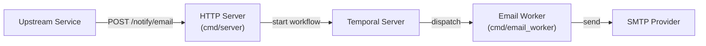

# Beacon — Architecture

## Overview

Beacon is an async notification service. Upstream services submit notification requests over HTTP; Beacon handles delivery asynchronously via Temporal workflows, decoupling the caller from the underlying provider.

## Components

### HTTP Server (`cmd/server`)

Entry point for all notification requests. It validates the request, starts a Temporal workflow, and returns `202 Accepted` immediately — the caller does not wait for delivery.

Also exposes `/healthz/live` and `/healthz/ready` for health checks.

### Email Worker (`cmd/email_worker`) — not yet implemented

The workflow and activity definitions live in `internal/temporal/`. A dedicated worker binary at `cmd/email_worker/` is planned but not yet present in the repository. Until it exists, Temporal workflows are enqueued but not executed.

### Config Service (`internal/config`)

Loads and validates SMTP provider configuration at startup. In production this is fetched from Infisical; in development it falls back to environment variables (`DEV_MODE=true`).

## Component Inventory

| Component | Path | Description |
|---|---|---|
| HTTP Server | `cmd/server/` | REST API for submitting notifications and health checks |
| Email Worker | `cmd/email_worker/` | Temporal worker that executes email send workflows _(not yet implemented)_ |
| Config Service | `internal/config/` | Loads and validates SMTP configs from Infisical (or dev env vars) |
| Email Notifier | `internal/notifier/` | SMTP email delivery using `gopkg.in/mail.v2` |
| Temporal Layer | `internal/temporal/` | Workflow and activity definitions |
| API Handlers | `internal/api/` | HTTP request/response handling |

## Request Lifecycle

1. Upstream POSTs `{ to, subject, body, client_hint? }` to `/notify/email`
2. HTTP server starts a Temporal workflow and returns `202` with the workflow ID, run ID, and selected provider
3. Temporal durably queues the workflow on the per-provider task queue
4. Email worker picks up the task and calls the SMTP provider _(worker not yet implemented — see above)_
5. On transient failure, Temporal retries automatically (3 attempts, exponential backoff)

## Tech Stack

| Concern | Technology |
|---|---|
| Language | Go 1.24 |
| Workflow orchestration | [Temporal](https://temporal.io) |
| Email delivery | SMTP via `gopkg.in/mail.v2` |
| Secret management | [Infisical](https://infisical.com) |
| Config | Environment variables + `.env` |
